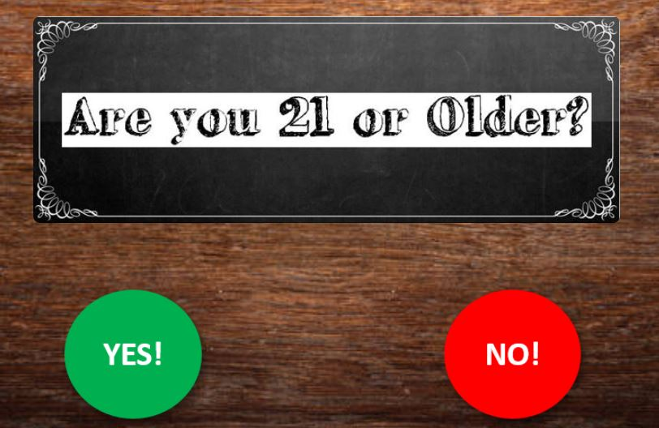

# Cocktail Creator Flask App

## Table of contents
* [Cocktail Creator](#cocktail-creator)
* [Technologies](#technologies)
* [Objective](#objective)
* [Extract](#extract)
* [Transform](#transform)
* [Load](#load)
* [Deploy](deploy)
* [Visualizations](#visualizations)
* [HTML](html)
* [Run Flask App](run-flask)
* [Heroku](heroku)
* [Resources](#resources)
* [Contacts](#contacts)

## Objective 

Our objective was to create an interactive website where you can find recipes for hundreds of unique cocktails.

Target Market:

* Bartenders
* Event Planners
* Restaurant Owners
* Quarantine – any cocktail you mix at home while in lockdown
* You in your next zoom Happy Hour
* You!!!

## Technologies

* SQL / Postgres DB
* Python
* HTML / CSS 
* Jupyter Notebook / Pandas
* Javascript Libraries: Leaflet, Jquery, Mapbox, Plotly
* New Library- [Vanilla autoComplete JS](https://github.com/TarekRaafat/autoComplete.js) 

# Extract

We gathered our cocktail data from sources like Kaggle, Cocktail DB and Kitchn. Our data was in the form of CSS. We also worked on web scraping, but we were not as successful in our attempts. We resorted to pulling data from the web scrape sites directly. Our data sources included information on cocktail types, ingredients, and recipes. We also had data sources with state longitude and latitude coordinates to help plot our “Cocktails by State” map in `leaflet` . 

# Transform

We loaded our css data into `jupyter notebook` to clean the data. One of the greatest discrepancies in our data was the measurement type and value for our ingredients. Some ingredients were listed in oz and some were listed in tsp or other quantites. We used formulas to transform our measurement values into a consistent ounce format. There were also `null` values in our measurements. To make the `null` values consistent we needed to view them and assign them corresponding values. For example, there was a lemon wedge ingredient with the value of `null` so we changed it to be a value of “1”. 
We combined data sets for state cocktail and geographic coordinates into one table to use for our map visualization. 

# Load

We chose to use a SLQ database in Postgres for our data because it is a more structured format. We hoped to have additional visualizations with more complicated queries, but we did not have time to complete them. We mapped out our database using Quick Database Diagram and created a schema. The schema assigned keys and foreign keys to help link our data together in our queries. We used the cocktail name as a our primary key. 
Once our [schema](https://github.com/Ssimoes48/Cocktail-Creator/blob/main/Schema/cocktail_db.sql) was loaded into Postgres, we ran our jupyter notebooks to load the data. 

# Deploy

In visual studio code using javascript, we created app routes to call our data queries from the SQL database. Once the data was called, we were able to create visualizations for our website. 

 
# Visualizations

We created several visualizations for our Cocktail Creator website. On our home page, we have a dropdown menu (d3) with our cocktail names that calls the recipe and how to make the drink. Adjacent to the recipe, there is a stacked bar chart visualization (plotly) that shows the ingredients and their measurements and proportions in the cocktail. Both visualizations are called when selected from the dropdown. 

The dropdown also uses a new Javascript library called [Vanilla autoComplete JS](https://github.com/TarekRaafat/autoComplete.js)  which allows the drop down to start to auto complete as you begin to type. 

On a separate web page, we have a visualization of a bubble chart (plotly) that shows the top state cocktails and their most popular ingredients. The chart has ‘hover over’ functionality so you can clearly see the ingredient types and cocktail name. 

Our final visualization is an interactive map of the United States that shows the most frequently googled cocktail by state in 2020. We created this using Leaflet.js and Mapbox. When you click each state, a popup appears that shows the state name, most popular cocktail, and an image of the cocktail. 

## HTML

We designed our interactive Cocktail Creator website using css formatting. To make the site a seamless experience for the user, we formatted each page with a matching themed background image and user-friendly navigation bar. We also added image headers to each page for consistency. 

## Run Flask

To Deploy our Flask App, please follow the below steps :
* step 1: Git clone our repository into your local

* step 2: Confirm that jupyter notebook is up and running with the env where you have the python libraries mentioned in the notebook installed

* step 3: Confirm that you have postgress app up and running in your machine

* step 4: Confirm that your postgress username and password along with the app id of your map-box is added to the config.py

* step 5: Create a database in postgres called 'cocktail_db'

* step 6: Use the [cocktail_db.txt](https://github.com/Ssimoes48/Cocktail-Creator/blob/main/Schema/cocktail_db.sql) inside schema folder to run the create table commands

* step 7: run all the jupyter notebooks in the following order:
	* [category_table](https://github.com/Ssimoes48/Cocktail-Creator/blob/main/DataCleaning/category_table.ipynb)
	* [cocktail_cleanup_function](https://github.com/Ssimoes48/Cocktail-Creator/blob/main/DataCleaning/cocktail_cleanup_function.ipynb)
	* [recipe_csv](https://github.com/Ssimoes48/Cocktail-Creator/blob/main/DataCleaning/recipe_csv.ipynb)
	* [state combine](https://github.com/Ssimoes48/Cocktail-Creator/blob/main/DataCleaning/state_combine.ipynb)

* step 8: Confirm [config.py](https://github.com/Ssimoes48/Cocktail-Creator/blob/main/config.py) has the right postgress url, username and password  

* step 9: Execute command python app.py and launch the server using URL: http://127.0.0.1:5000/

## Heroku

[Cocktail Creator Heroku Link](https://makeyourcocktails.herokuapp.com) We worked to deploy our app to Heroku however, we had issues initializing our data and calling the data to our server. If you view the above link, you will see our website and some of the visualizations load, there is just no data being populated. We are going to continue to work on this.

## Resources

[Cocktail Data](https://github.com/rfordatascience/tidytuesday/blob/master/data/2020/2020-05-26/readme.md)

[Most Popular Cocktail Recipe In Every State In 2020 | Kitchn](https://www.thekitchn.com/most-popular-cocktail-recipes-covid-23038322)

[Ingredients vs ideas of visualizations](https://www.thecocktaildb.com/api.php)

[State Latitude and Longitude](https://www.kaggle.com/washimahmed/usa-latlong-for-state-abbreviations)

## Contact

[Elliott McFarland](https://github.com/emcfarland)

[Celeste Muniz](https://github.com/celeste1030)

[Saroja Shreenivasan](https://github.com/shreeniv)

[Sai Prasanna](https://github.com/prasanna0913)

[Tim Samson](https://github.com/timsamson)

[Sara Simoes](https://github.com/Ssimoes48)

